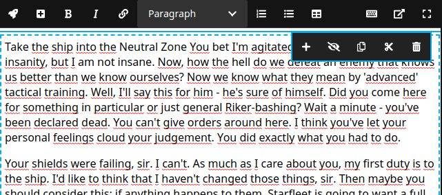

# Neos simple editor extend

This is a small plugin to simply add some buttons to the Neos CMS CKEditor, without writing any JavaScript code. You only need to compose a YAML-File. 

## Installation
Most of the time you have to make small adjustments to a package (e.g., the configuration in Settings.yaml). Because of that, it is important to add the corresponding package to the composer from your theme package. Mostly this is the site package located under Packages/Sites/. To install it correctly go to your theme package (e.g.Packages/Sites/Foo.Bar) and run following command:

```bash
composer require breadlesscode/neos-simple-editor-extend --no-update
```

The --no-update command prevent the automatic update of the dependencies. After the package was added to your theme composer.json, go back to the root of the Neos installation and run composer update. Your desired package is now installed correctly.

## Demo



## Example configuration

```yaml
Breadlesscode:
    SimpleEditorExtend:
      buttons:
        'Test.Test:MyCustomSpan':
          extensionName: 'exampleExtension'
          icon: 'plus-square'
          tooltip: 'Mark the text in color green'
          position: 'before strong'
          formatting:
            tag: 'span'
            classes: 'test-class'
            styles:
              background-color: 'green'
        'Test.Test:MyCustomSpan2':
          extensionName: 'exampleExtension2'
          icon: 'rocket'
          tooltip: 'Mark the text in color red'
          position: 'before exampleExtension'
          formatting:
            tag: 'span'
            classes: 'test-class-2'
            styles:
              background-color: 'red'
```

Now you can use your new formattings like this:

```yaml
'Neos.NodeTypes.BaseMixins:TextMixin':
  properties:
    text:
      ui:
        inline:
          editorOptions:
            formatting:
              'Test.Test:MyCustomSpan': true
              'Test.Test:MyCustomSpan2': true
```

## License
The MIT License (MIT). Please see [License File](LICENSE) for more information.
